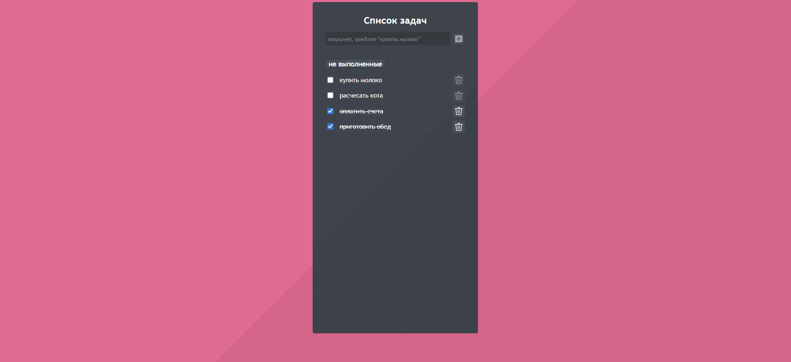

# Todos App (учебный проект)

## Описание проекта
Учебное приложение для управления задачами с акцентом на тестирование. Проект разработан для практики различных подходов к тестировани.


### Основные технологии
- **React** 
- **Redux Toolkit**
- **TypeScript**
- **Webpack 5**
- **Jest** + **Testing Library** 

### Тестирование
- Полная настройка Jest для React+TypeScript
- Интеграция Testing Library
- Поддержка snapshot-тестирования
- Настройка окружения (jest-environment-jsdom)

## Установка и запуск

### Установка зависимостей
```bash
npm install
```
### Запуск dev-сервера
```bash
npm start
```
### Production сборка
```bash
npm run build
```
### Запуск тестов
```bash
npm test
```

## Скриншот интерфейса

